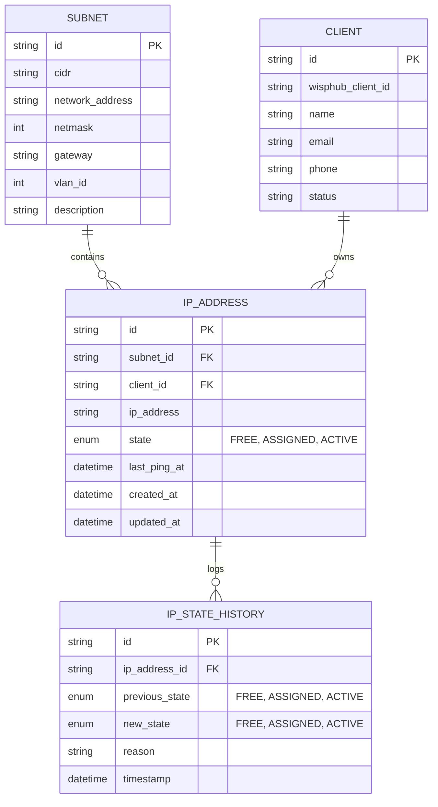

# 🌐 IPAM System - Gestión de Direcciones IP & Diagnóstico de Red

Un sistema integral de **IPAM** (*IP Address Management*) diseñado para la administración, monitoreo, asignación y diagnóstico asíncrono de redes y subredes para ISPs y gestores de red.

Combining a **Python** backend core for async network scanning and database management with a **Laravel/Tailwind CSS** frontend, the system allows full visibility over IP allocation, client assignments, and reachability history.

---

## 🚀 Estado Actual y Avances del Proyecto

### Phase 1: Core IPAM Engine & Database (Completado)
- **Multi-DB Support:** Agnostic ORM setup with **SQLAlchemy 2.0** and **Alembic**, fully compatible with **PostgreSQL** and **MySQL**.
- **Data Models:** Relational management of `Subnet`, `Client`, `IPAddress`, and `IPStateHistory`.
- **State Auditing:** Automatic log creation (`IPStateHistory`) on state changes and diagnostic query events.

### Phase 2: Async Diagnostic Engine & Range Scanner (Completado)
- **ICMP Ping Service (`ping_service.py`):** Cross-platform execution (Windows, Linux, macOS) without requiring elevated root privileges.
- **Async Range Scanner (`range_scanner.py`):** Asynchronous subnet/range ping scans using `asyncio` bounded by semaphore limits (`MAX_HOSTS_PER_SCAN = 1024`).
- **Deep TCP Port Scanner (`tcp_scanner.py`):** Async probing on strategic network management ports (80, 443, 8291 [Winbox/Mikrotik], 22, 53, 8080, 23).
- **Security Authorization (`authorization.py`):** PIN-protected execution layer for heavy/intrusive network scans (`PROVIDER_PIN`).
- **State Evaluation Engine (`evaluation.py` / `single_query.py`):** Automated logic to evaluate IP responsiveness and update statuses (`FREE`, `ASSIGNED`, `ACTIVE`).
- **WispHub Adapter Stub (`wisphub_adapter.py`):** Interface prepared for sync with the WispHub API.

### Phase 3: Web Dashboard Integration (En Desarrollo)
- **Laravel / Vite / Tailwind CSS v4 setup** integrated into the structure to expose APIs and provide an interactive web interface.

---

## 📂 Estructura del Proyecto

```text
.
├── app/
│   ├── Models/                     # Modelos de SQLAlchemy
│   │   ├── client.py               # Modelo Client
│   │   ├── ip_address.py           # Modelo IPAddress
│   │   ├── ip_state_history.py     # Modelo IPStateHistory
│   │   └── subnet.py               # Modelo Subnet
│   ├── services/                   # Motores de Diagnóstico y Red
│   │   ├── authorization.py        # Validación de PIN para escaneos
│   │   ├── evaluation.py           # Lógica de transición de estados de IP
│   │   ├── ping_service.py         # Motor ejecutor de Ping ICMP
│   │   ├── range_scanner.py        # Escaneo asíncrono de rangos/subredes
│   │   ├── single_query.py         # Consulta y diagnóstico individual
│   │   ├── tcp_scanner.py          # Escaneo asíncrono de puertos TCP (Mikrotik, SSH, Web)
│   │   └── wisphub_adapter.py      # Adaptador de integración WispHub
│   ├── config.py                   # Configuración y variables de entorno Python
│   └── database.py                 # Conexión SQLAlchemy y Session Local
├── alembic/                        # Migraciones de base de datos con Alembic
├── demo_crud.py                    # Script ejecutable de demostración CRUD
├── demo_range_scan.py              # Script ejecutable de demostración de escaneo
├── bootstrap/                      # Core de arranque Laravel
├── config/                         # Configuraciones de Laravel
├── database/                       # Migraciones y seeders de Laravel
├── resources/                      # Vistas Blade y CSS/JS (Tailwind CSS v4)
├── routes/                         # Rutas de Laravel (web, api)
├── alembic.ini                     # Configuración de Alembic
├── requirements.txt                # Dependencias de Python
└── package.json                    # Dependencias de Node/Vite/Tailwind
```

---

## 🗄️ Modelo de Datos



### Detalle de Entidades

1. **Subnet (`subnets`)**:
   - `id`: Identificador único UUID.
   - `cidr`: Notación CIDR (ej. `192.168.1.0/24`).
   - `network_address`: Dirección de red.
   - `netmask`: Máscara de red en formato numérico/CIDR.
   - `gateway`: Puerta de enlace predeterminada.
   - `vlan_id`: Identificador VLAN opcional.

2. **Client (`clients`)**:
   - `id`: Identificador interno.
   - `wisphub_client_id`: ID externo de integración con WispHub.
   - `name`, `email`, `phone`: Información general de contacto.
   - `status`: Estado del cliente en la plataforma.

3. **IPAddress (`ip_addresses`)**:
   - `ip_address`: Dirección IP estática (ej. `192.168.1.50`).
   - `state`: Estado actual (`FREE`, `ASSIGNED`, `ACTIVE`).
   - `last_ping_at`: Fecha y hora de la última respuesta exitosa por ICMP.

4. **IPStateHistory (`ip_state_histories`)**:
   - Bitácora de auditoría que registra las transiciones entre estados (`previous_state` -> `new_state`) con timestamp y razón del cambio (ej. "Escaneo de rango detectó host activo").

---

## 🛠️ Requisitos Previos e Instalación

### Requisitos
- **Python:** 3.10 o superior (Recomendado 3.13)
- **Base de Datos:** SQLite (para pruebas rápidas), PostgreSQL o MySQL.
- **Node.js:** v18+ (para recursos de frontend).

### Instalación de Entorno Python

1. Clonar o extraer el proyecto en la ruta deseada.
2. Crear y activar un entorno virtual:
   ```bash
   python -m venv venv
   # En Linux/macOS:
   source venv/bin/activate
   # En Windows:
   venv\Scripts\activate
   ```
3. Instalar las dependencias de Python:
   ```bash
   pip install -r requirements.txt
   ```
4. Configurar el archivo de entorno `.env` en la raíz (puedes crear uno a partir del ejemplo):
   ```ini
   DATABASE_URL=sqlite:///./ipam.db
   PROVIDER_PIN=231451267
   ```
5. Aplicar migraciones con Alembic:
   ```bash
   alembic upgrade head
   ```

---

## 🖥️ Instrucciones para Ejecutar las Demos

El proyecto incluye dos scripts ejecutables interactivos en consola que permiten probar el motor de base de datos y los servicios de red asíncronos.

### Demo 1: Gestión CRUD de Datos (`demo_crud.py`)

Esta demo permite ejercitar la creación, consulta y asociación de Clientes, Subredes y Direcciones IP.

**Ejecución:**
```bash
python demo_crud.py
```

**Funcionalidades de la Demo:**
- Registro automático de datos de prueba (Clientes de ejemplo, Subred `10.0.0.0/24`).
- Asignación de IPs a clientes.
- Consulta e impresión en consola del estado de las tablas de la base de datos.

---

### Demo 2: Escaneo de Rangos y Diagnóstico de Red (`demo_range_scan.py`)

Esta demo interactiva permite realizar escaneos ICMP asíncronos por bloques de red o rangos de IPs especificadas, mostrando en tiempo real el estado de respuesta y actualización en la base de datos.

**Ejecución:**
```bash
python demo_range_scan.py
```

**Flujo del Escaneo:**
1. **Verificación de PIN:** El script solicitará el PIN del proveedor antes de habilitar escaneos avanzados (PIN por defecto: `231451267`).
2. **Selección de Modo:**
   - **Opción A:** Escaneo por CIDR/Red (Ejemplo: `192.168.1.0/28`).
   - **Opción B:** Escaneo por Rango de IPs (Ejemplo: `192.168.1.1` a `192.168.1.30`).
   - **Opción C:** Diagnóstico individual de IP con escaneo de puertos TCP clave (Winbox 8291, Web 80/443, SSH 22).
3. **Resultado:** Visualización de latencia, IPs activas/inactivas y el registro en la bitácora `IPStateHistory`.

---

## 🔒 Autorización de Seguridad

Para la ejecución de escaneos de puertos y diagnósticos invasivos se requiere validación por PIN de proveedor administrado por `authorization.py`. El PIN se configura mediante la variable de entorno `PROVIDER_PIN`.

```bash
# Cambiar el PIN de autorización en producción
export PROVIDER_PIN="TuPINSeguro123"